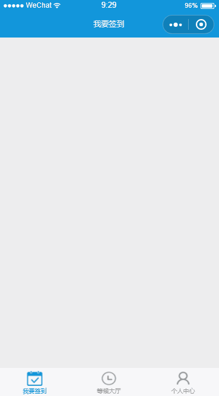

# miniprogram-sign

一个微信小程序Demo，简单的签到功能，页面的数据为假数据

支持 ES6+/SCSS 进行开发，代码分包等基本功能

## 目录结构

使用 [Gulp](https://www.gulpjs.com.cn/) 进行构建，主要为了支持SCSS语法，以及做一些文件压缩

使用 [wxPromise](https://github.com/youngjuning/wxPromise) 对小程序的API进行API化，同时支持 `async/await`

`dist` 目录为小程序使用的文件目录，在小程序开发者工具种导入这个目录，进行编译查看

`src` 为开发目录，在其中进行修改，然后使用Gulp进行编译监听即可

## 使用说明

> cd miniprogram-sign

> npm i

> npm start

**自配置部分**

- AppID: `src/project.config.json` 中的 appid
- [腾讯地图位置服务](https://lbs.qq.com/qqmap_wx_jssdk/index.html)的密钥：`src/app.js` 中的 key
- 文件上传，接口请求的地址：`src/pages/index/index.js` 中的相关部分

[更多说明](dd)
